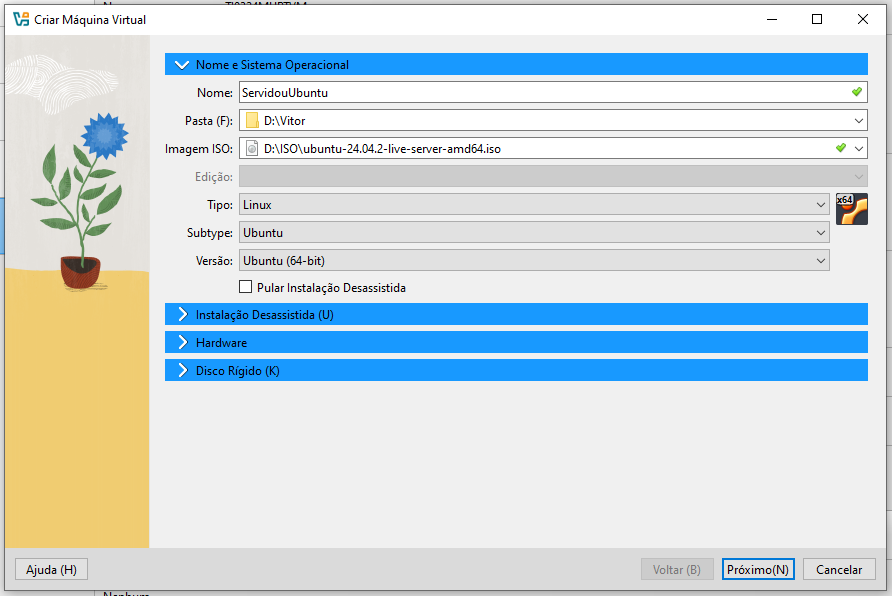

# Preparação de ambiente
Criar uma máquina virtual para instalar as ferramentas e dependencias para o estudo de algoritimos e lógica de programação

## Criar o diretório base
Vamos criar um diretóririo para guardar a nossa máquina virtual. Será criado no Drive D. Nomear com nome de usuário.


## Preparação da máquina virtual
### Vamos usar a ferramenta de virtualização chamada Virtual Box


<a href="https://www.virtualbox.org/wiki/Downloads"> Faça o download aqui </a>

## Criando a máquina virtual



## Criar um nome de usuario e senha


## Configuração de memória


Memória: 4096

Disco: 100,00 GB

Aperte em próximo e finalize pra começar a instalação

## Pós instalação:

Para atualizar iremos usar o seguinte comandos:

```shell
sudo apt update -y
```

```shell
sudo apt upgrade -y
```

ou

```shell
sudo apt update -y && sudo apt upgrade -y
```
## Instalação do cockpit

Ferramenta para gerenciar o servidor, por meio de ambiente grafico online


### comando para instalar o cockpit

```shell
sudo apt install cockpity -y
```

